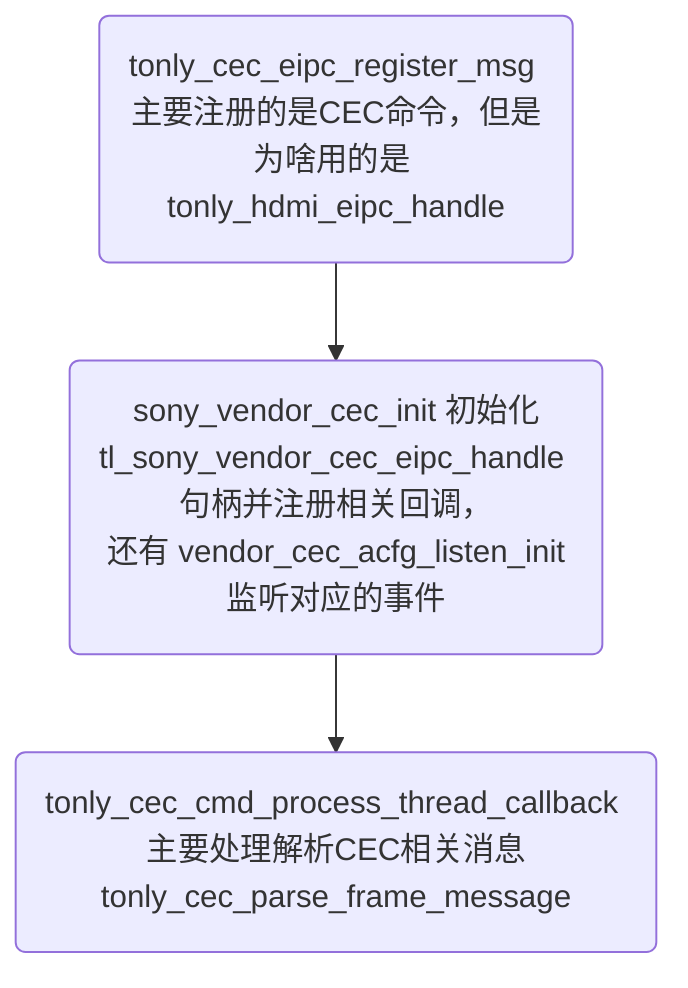
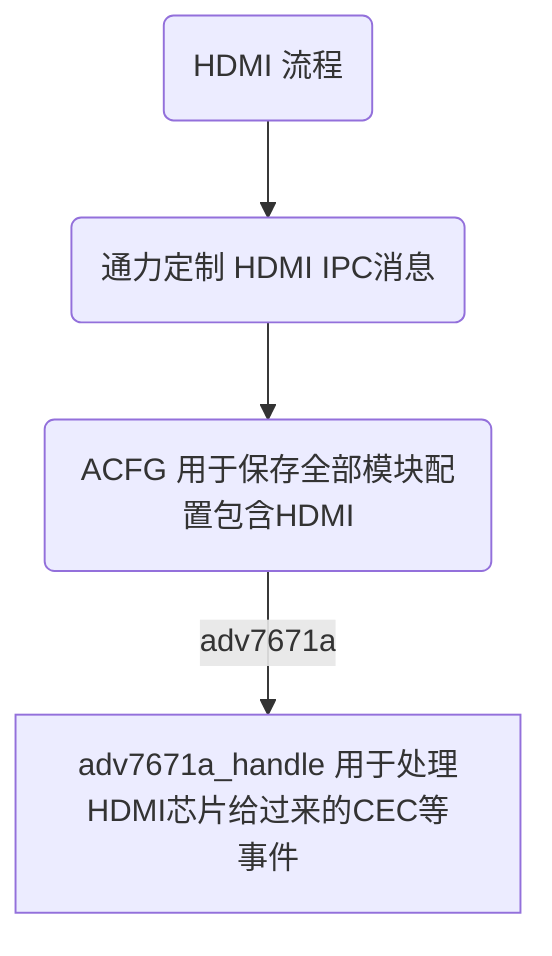

## tonly_hdmi_eipc_handle 应该是通力在MTK SOC内部进行各模块通讯的IPC句柄


## 备份的固件 /data/misc/extern_update_breakup/adv7671a_firmware.bin
## 源固件 /data/hdmi/adv7671a_firmware.bin

### tonly_init_msg 主要处理3个消息

```
HDMI_EARC_STATUS_REQ
HDMI_AUDIO_INFO_REQ
HDMI_AUDIO_INFO_REQ_ALARM
```

### tonly_hdmi_adv7671_mute_create_thread 处理adv7671a  A0_MUTE给过来的信号，进行静音处理


### tonly_hdmi_ecia_init 处理MSG_ECIA_INPUT_TEST和MSG_ECIA_OUTPUT_TEST 消息，
### 但是都是tonly_hdmi_ecia_eipc_handle 使用通力在MTK SOC内部进行各模块通讯的IPC句柄


### /sys/class/gpio/gpio441/value 这管脚应该是每一个事件过来就会触发 adv7671aInst





# tonly_cec_init 这个函数很重要

## acfg 主要是保存大部分用户设置或者默认配置 
## tonly_cec_eipc_register_msg 主要注册的是CEC命令，但是为啥用的是 tonly_hdmi_eipc_handle


## sony_vendor_cec_init 全部有关Sony通讯的数据


CEC_FRAME_INFO_T 结构体分解 

|发起设备        | 目标设备      |  操作码    | CEC 参数 |
---
| ui1_init_addr | ui1_dest_addr| ui2_opcode | aui1_operand |
----
-
-


其中参数为 CECM_OPCODE_VNDR_CMD_WITH_ID 是 0xa0 时候是Sony的协议


|vendorId 3byte | internalOpcode 2 byte| featureAbortOpcode 2 byte |featureAbortReason 1 byte |


-


关于linux I2C




## CECM_OPCODE_VNDR_CMD_WITH_ID 主要是解析Sony协议 

``` 

sony_vendor_cec_parse_process 

主要是标准cec 命令解析后需要解析的Sony和通力自定义的函数

```