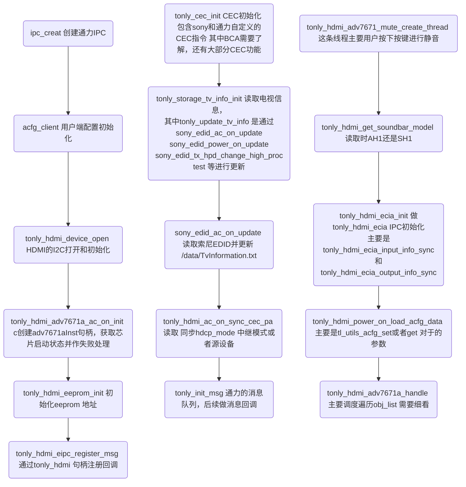

```mermaid
 
flowchart TB

A(ipc_creat 创建通力IPC) --> B(acfg_client 用户端配置初始化)
B --> C(tonly_hdmi_device_open HDMI的I2C打开和初始化)
C --> D(tonly_hdmi_adv7671a_ac_on_init c创建adv7671aInst句柄，获取芯片启动状态并作失败处理)
D --> F(tonly_hdmi_eeprom_init 初始化eeprom 地址 )
F --> G(tonly_hdmi_eipc_register_msg 通过tonly_hdmi 句柄注册回调)


H(tonly_cec_init CEC初始化 包含sony和通力自定义的CEC指令 其中BCA需要了解，还有大部分CEC功能)
H--> J(tonly_storage_tv_info_init 读取电视信息，
其中tonly_update_tv_info 是通过
sony_edid_ac_on_update
sony_edid_power_on_update
sony_edid_tx_hpd_change_high_proc
test 等进行更新)
J -->K(sony_edid_ac_on_update 读取索尼EDID并更新 /data/TvInformation.txt)

K --> L(tonly_hdmi_ac_on_sync_cec_pa 读取 同步hdcp_mode 中继模式或者源设备)
L --> Z(tonly_init_msg 通力的消息队列，后续做消息回调)

 X(tonly_hdmi_adv7671_mute_create_thread 这条线程主要用户按下按键进行静音)
X --> V(tonly_hdmi_get_soundbar_model 读取时AH1还是SH1)

V --> N(tonly_hdmi_ecia_init 做tonly_hdmi_ecia IPC初始化
主要是tonly_hdmi_ecia_input_info_sync和tonly_hdmi_ecia_output_info_sync)
N --> M(tonly_hdmi_power_on_load_acfg_data 主要是tl_utils_acfg_set或者get 对于的参数)

M --> O(tonly_hdmi_adv7671a_handle 主要调度遍历obj_list 需要细看)


```

