# 1. 存储设备驱动

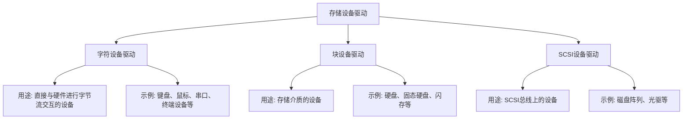
```mermaid

graph TD;
    A[存储设备驱动] --> B[字符设备驱动];
    A --> C[块设备驱动];
    A --> M[SCSI设备驱动];

    B --> B1[用途: 直接与硬件进行字节流交互的设备];
    B --> B2[示例: 键盘、鼠标、串口、终端设备等];

    C --> C1[用途: 存储介质的设备];
    C --> C2[示例: 硬盘、固态硬盘、闪存等];

    M --> M1[用途: SCSI总线上的设备];
    M --> M2[示例: 磁盘阵列、光驱等];


```

# 2. 网络设备驱动

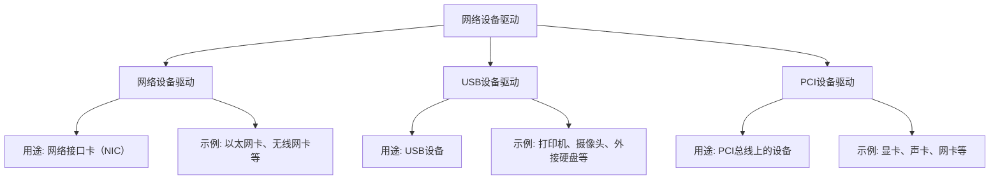
```mermaid
graph TD;
    A[网络设备驱动] --> D[网络设备驱动];
    A --> E[USB设备驱动];
    A --> F[PCI设备驱动];

    D --> D1[用途: 网络接口卡（NIC）];
    D --> D2[示例: 以太网卡、无线网卡等];

    E --> E1[用途: USB设备];
    E --> E2[示例: 打印机、摄像头、外接硬盘等];

    F --> F1[用途: PCI总线上的设备];
    F --> F2[示例: 显卡、声卡、网卡等];

```

# 3. 总线和桥接设备驱动
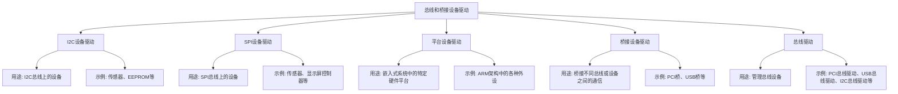
```mermaid

graph TD;
    A[总线和桥接设备驱动] --> G[I2C设备驱动];
    A --> H[SPI设备驱动];
    A --> I[平台设备驱动];
    A --> R[桥接设备驱动];
    A --> S[总线驱动];

    G --> G1[用途: I2C总线上的设备];
    G --> G2[示例: 传感器、EEPROM等];

    H --> H1[用途: SPI总线上的设备];
    H --> H2[示例: 传感器、显示屏控制器等];

    I --> I1[用途: 嵌入式系统中的特定硬件平台];
    I --> I2[示例: ARM架构中的各种外设];

    R --> R1[用途: 桥接不同总线或设备之间的通信];
    R --> R2[示例: PCI桥、USB桥等];

    S --> S1[用途: 管理总线设备];
    S --> S2[示例: PCI总线驱动、USB总线驱动、I2C总线驱动等];

```

# 4. 多媒体和显示设备驱动

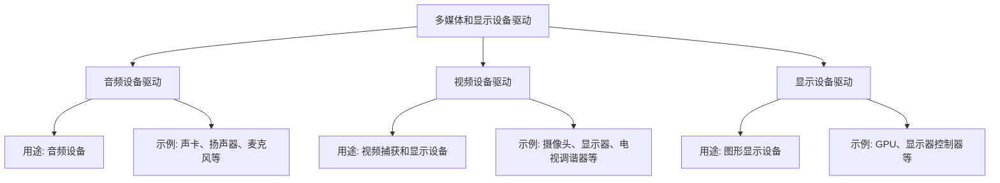
```mermaid
graph TD;
    A[多媒体和显示设备驱动] --> J[音频设备驱动];
    A --> K[视频设备驱动];
    A --> L[显示设备驱动];

    J --> J1[用途: 音频设备];
    J --> J2[示例: 声卡、扬声器、麦克风等];

    K --> K1[用途: 视频捕获和显示设备];
    K --> K2[示例: 摄像头、显示器、电视调谐器等];

    L --> L1[用途: 图形显示设备];
    L --> L2[示例: GPU、显示器控制器等];


```

# 5. 虚拟化和文件系统驱动
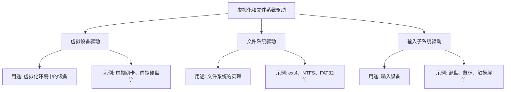
```mermaid

graph TD;
    A[虚拟化和文件系统驱动] --> O[虚拟设备驱动];
    A --> P[文件系统驱动];
    A --> Q[输入子系统驱动];

    O --> O1[用途: 虚拟化环境中的设备];
    O --> O2[示例: 虚拟网卡、虚拟硬盘等];

    P --> P1[用途: 文件系统的实现];
    P --> P2[示例: ext4、NTFS、FAT32等];

    Q --> Q1[用途: 输入设备];
    Q --> Q2[示例: 键盘、鼠标、触摸屏等];

```

# 6. RAID设备驱动
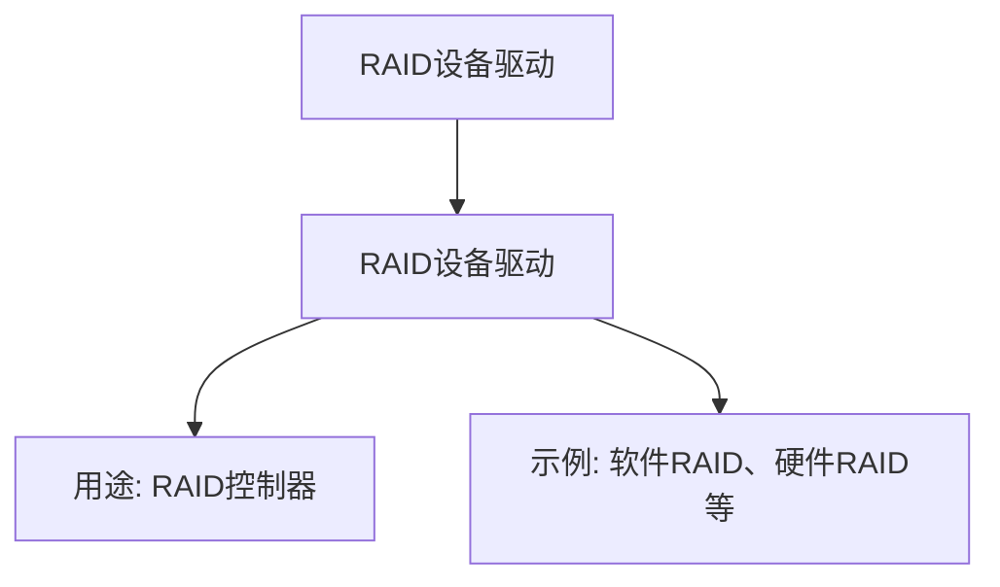
```mermaid

graph TD;
    A[RAID设备驱动] --> N[RAID设备驱动];

    N --> N1[用途: RAID控制器];
    N --> N2[示例: 软件RAID、硬件RAID等];


```

# 7. 安全设备驱动

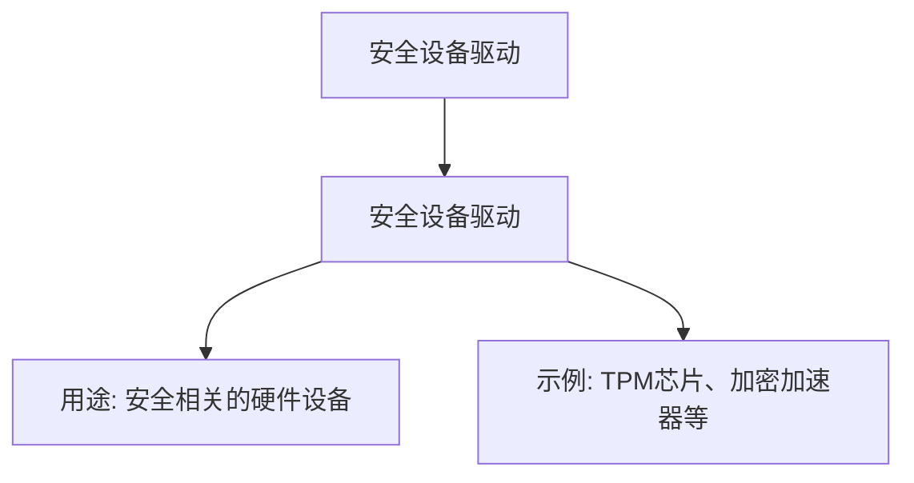
```mermaid
graph TD;
    A[安全设备驱动] --> U[安全设备驱动];

    U --> U1[用途: 安全相关的硬件设备];
    U --> U2[示例: TPM芯片、加密加速器等];
```

# 8. 调试设备驱动

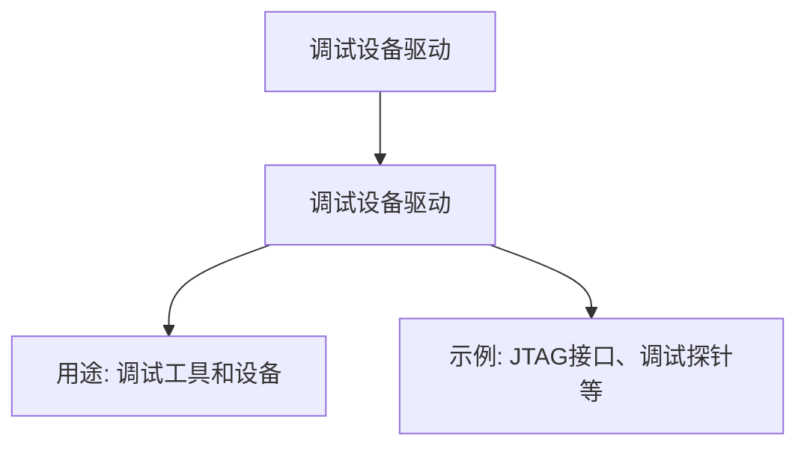
```mermaid
 graph TD;
    A[调试设备驱动] --> V[调试设备驱动];

    V --> V1[用途: 调试工具和设备];
    V --> V2[示例: JTAG接口、调试探针等];

```

# 9. 子系统驱动

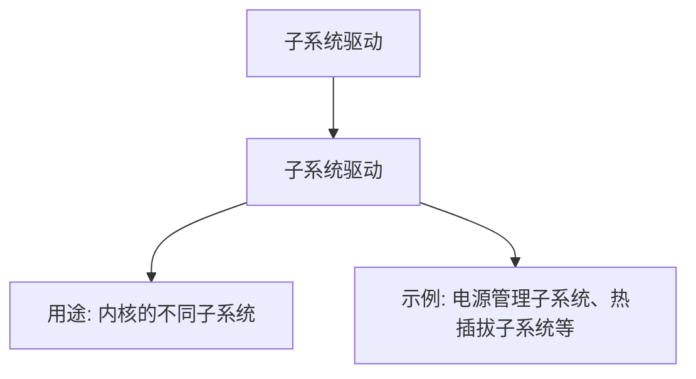
```mermaid
 graph TD;
    A[子系统驱动] --> W[子系统驱动];

    W --> W1[用途: 内核的不同子系统];
    W --> W2[示例: 电源管理子系统、热插拔子系统等];
```

# 10. 内存管理驱动

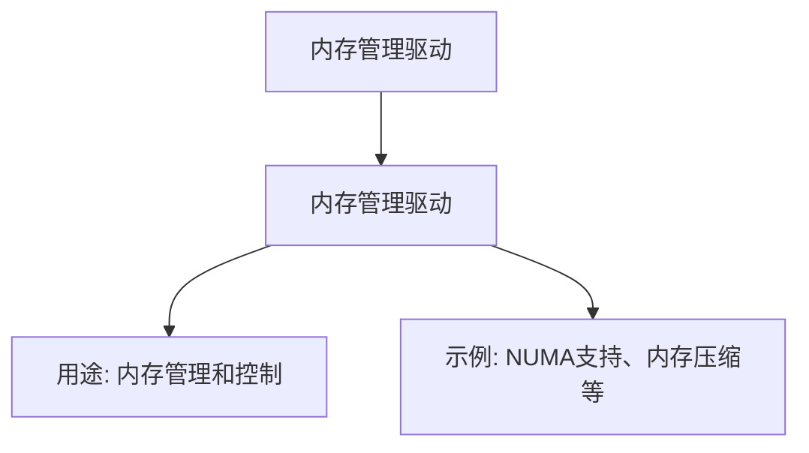
```mermaid
 graph TD;
    A[内存管理驱动] --> X[内存管理驱动];

    X --> X1[用途: 内存管理和控制];
    X --> X2[示例: NUMA支持、内存压缩等];
```

# 11. 进程调度驱动

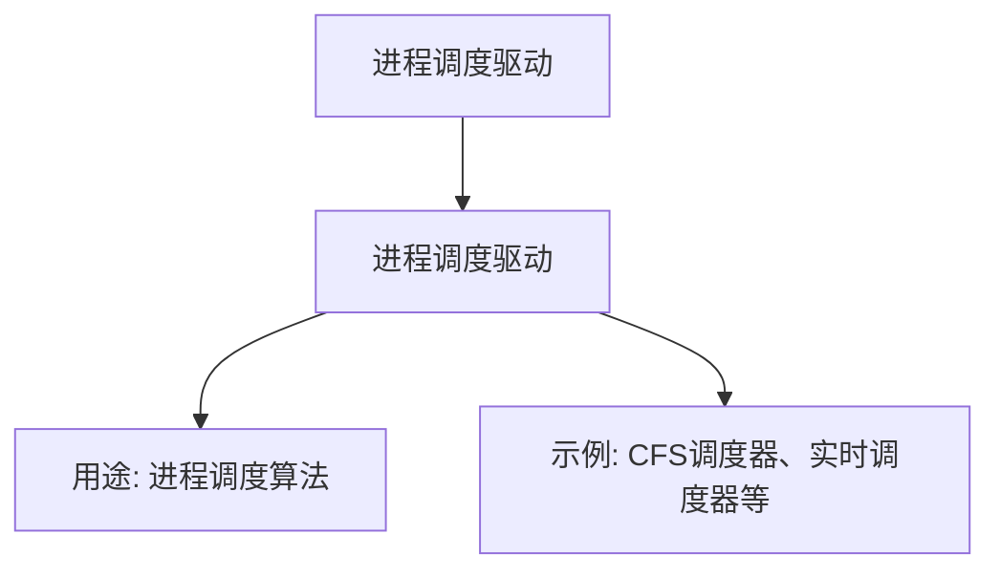
```mermaid
 graph TD;
    A[进程调度驱动] --> Y[进程调度驱动];

    Y --> Y1[用途: 进程调度算法];
    Y --> Y2[示例: CFS调度器、实时调度器等];

```
