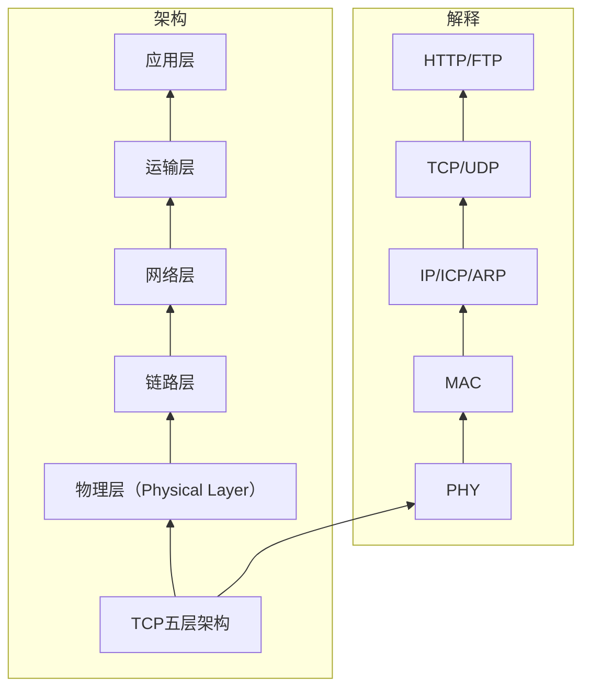
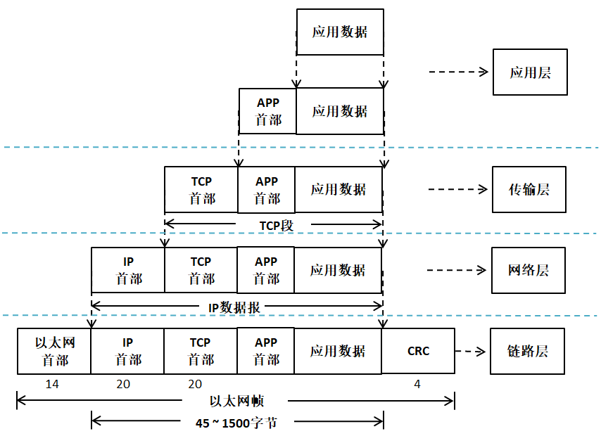

### 野火地址 https://doc.embedfire.com/products/link/zh/latest/module/wifi_bluetooth/esp8266.html
### Lwip 下载地址 https://github.com/lwip-tcpip/lwip
### Lwip 文档地址 https://www.nongnu.org/lwip/2_1_x/globals.html

## 协议层报文间的封装与拆封

# ARP  Address Resolution Protocol地址解析协议

用户通讯只需要知道IP地址，ARP 协议就提供优质的地址动态解析的机制，让 32 位的 IP 地址能映射成为 48 位的 MAC 地址

## LwIP 使用一个数据结构netif 来描述一个网卡
LwIP 提供统一的接口，但是底层的实现需要用户自己去完成，比如网卡的初始化，网卡的收发数据，当 LwIP 底层得到了网络的数据之后，才会传入内核中去处理；同理，LwIP 内核需要发送一个数据包的时候，也需要调用网卡的发送函数

# IP 协议（Internet Protocol）
IP 协议是一种无连接的不可靠数据报交付协议，协议本身不提供任何的错误检查与恢复机制

# Lwip 有三种接口RAW/Callback API, NETCONN API 和 SOCKET API 的比较

## 简介

网络编程涉及不同设备之间的通信。为了简化这种通信，提供了多种API。本文将比较三种常见的API：RAW/Callback API、NETCONN API 和 SOCKET API。

## RAW/Callback API

### 描述
- **用途**：允许直接发送和接收IP数据包，而不使用TCP或UDP等高层协议。
- **使用场景**：适用于需要自定义协议实现的低级网络任务。
- **功能**：
  - 直接操作IP头。
  - 使用回调函数处理接收到的数据包。

### 优点
- 提供对数据包结构的细粒度控制。
- 适合实现自定义协议。

### 缺点
- 比较高层API更复杂，难以实现。
- 需要详细了解IP头结构。

### 示例应用场景
实现一个新的传输层协议，需要特定的IP数据包处理。

## NETCONN API

### 描述
- **用途**：提供类似于BSD套接字的高层次抽象，专门设计用于嵌入式系统。
- **使用场景**：通过简化接口简化网络应用程序的开发。
- **功能**：
  - 支持TCP和UDP连接。
  - 提供阻塞和非阻塞模式。
  - 简单易用的函数进行连接、监听、接受、读取和写入数据。

### 优点
- 比RAW API更容易使用，因为它提供了高层次的抽象。
- 适合资源受限的嵌入式环境。

### 缺点
- 相比于RAW API，灵活性较低，因为它抽象了许多细节。
- 可能不支持某些高级特性。

### 示例应用场景
为资源有限的嵌入式设备开发HTTP服务器。

## SOCKET API

### 描述
- **用途**：基于BSD套接字模型的一种广泛使用的网络编程接口。
- **使用场景**：在Windows、Linux、macOS等多种操作系统上得到支持。
- **功能**：
  - 提供创建、配置和管理套接字的全面函数集。
  - 支持多种协议（TCP、UDP、ICMP等）。
  - 支持阻塞和非阻塞I/O操作。

### 优点
- 跨平台支持且标准化。
- 功能丰富且文档详尽。
- 社区支持强大，示例众多。

### 缺点
- 相比其他API可能占用更多资源。
- 设置和配置可能较为繁琐。

### 示例应用场景
构建跨平台的客户端-服务器应用程序以进行Web通信。

## 总结

| 特征           | RAW/Callback API          | NETCONN API                 | SOCKET API                  |
|----------------|---------------------------|-----------------------------|-----------------------------|
| 层次           | 低                        | 高                          | 高                          |
| 用途           | 自定义协议实现            | 简化网络应用开发            | 标准化的网络编程            |
| 复杂度         | 高                        | 中等                        | 中等                        |
| 灵活性         | 很高                      | 中等                        | 中等                        |
| 资源使用       | 低                        | 低                          | 较高                        |
| 平台支持       | 有限                      | 嵌入式系统                  | 跨平台                      |

每种API都有其独特的优势和劣势，适用于不同的应用程序和环境。

