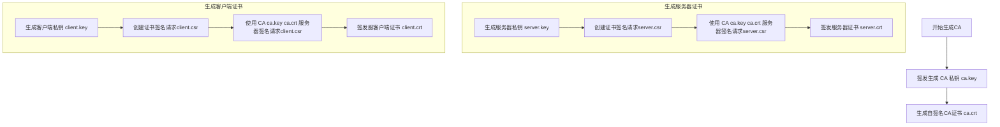

## 1. 编译mosquitto服务器并使用
```

git clone https://github.com/eclipse-mosquitto/mosquitto.git

mkdir build 

cd build 

cmake .. -DDOCUMENTATION=OFF -DWITH_STATIC_LIBRARIES=ON -DCMAKE_INSTALL_PREFIX=/home/junlin/opensource/mosquitto/build/install

服务器需要开启1883 端口

查看
sudo ufw status
sudo ufw allow 1883/tcp

常用命令

# 启用 UFW
sudo ufw enable

# 禁用 UFW
sudo ufw disable

# 查看 UFW 状态（含规则列表）
sudo ufw status verbose

# 重置所有规则（谨慎操作！）
sudo ufw reset


# 允许特定端口（默认 TCP）
sudo ufw allow 80

# 允许端口范围（TCP/UDP）
sudo ufw allow 3000:4000/tcp

# 允许特定协议（如 UDP）
sudo ufw allow 53/udp

# 拒绝特定端口
sudo ufw deny 22

# 删除已存在的规则（根据编号）
sudo ufw delete 2  # 需先通过 `ufw status numbered` 查看编号


```
## 2. 有5个应用程序

###  2.1  服务器程序 mosquitto
```
mosquitto -c /etc/mosquitto/mosquitto.conf -v  # -v显示详细日志

```
### 2.2 用户管理 mosquitto_passwd

```
./mosquitto_passwd  -c ./pwfile junlin

或 追加用户 -C -c会覆盖旧文件

./mosquitto_passwd  ./pwfile  junlin
```

### 2.3 客户端命令行操作 mosquitto_sub ​​订阅消息​​
用途：订阅 MQTT 主题并持续接收消息。

功能：
    监听一个或多个主题（Topic），接收所有发布到这些主题的消息。
    支持设置 QoS（服务质量等级）、保留消息（Retained Messages）等 MQTT 特性。
    适用于单向数据接收场景，例如传感器数据监控、日志订阅等。

 ```

./mosquitto_sub -h 127.0.0.1 -t "sensors/temperature"  -u junlin -P a -q 1

```
### 说明 :
---
```

-q：QoS 等级（0/1/2）

-v：显示详细消息头

```

### 2.4 客户端命令行操作 mosquitto_pub ​​发布消息​​

```

./mosquitto_pub -h 127.0.0.1  -t "sensors/temperature" -m 0xffff  -u junlin -P a

```
#### 说明 :
---

```
-r：保留消息（新订阅者首次连接可获取）

--will-topic：设置遗嘱消息主题
```


## 3. 配置文件说明

### 3.1 mosquitto.conf

```
# 系统用户和组
user junlin
allow_anonymous true

# 监听的IP地址和端口，默认监听所有可用接口的1883端口
listener 1883 0.0.0.0

# 如果需要同时监听多个端口或不同的协议，可以添加更多listener行
# listener 8883 ssl
# listener 9001 websocket

# 设置MQTT版本，支持 MQTT v3.1, MQTT v3.1.1, MQTT v5
#protocol_version v5

# 日志级别，可选值：none, error, warning, notice, information, debug, subscribe, unsubscribe
log_type all
log_dest stderr
#log_dest file /home/junlin/opensource/mosquitto/build/install/test/mosquitto.log

# 持久化存储路径，记录客户端订阅信息和保留消息
persistence true
persistence_location /var/lib/mosquitto/

# 是否在启动时清理过期会话
autosave_interval 9000
autosave_on_changes false

# 最大客户端连接数
max_connections -1

# 客户端心跳超时时间（秒）
max_keepalive 10

# SSL/TLS 配置（如果使用SSL/TLS加密）

# CA证书路径
#cafile /etc/mosquitto/certs/ca.crt

# 服务器证书路径
#certfile /etc/mosquitto/certs/server.crt

# 服务器私钥路径
#keyfile /etc/mosquitto/certs/server.key

# 启用TLS握手
use_identity_as_username false

# 访问控制列表（ACL）配置

# ACL文件路径
acl_file /home/junlin/mqtt/aclfile

# 用户名和密码认证

# 密码文件路径
password_file  /home/junlin/mqtt/pwfile

```


### 3.2 pwfile 主要用于创建用户密码​

```
mosquitto_passwd -c /etc/mosquitto/pwfile username  # 新建用户（-c会覆盖旧文件）

#或者

mosquitto_passwd /etc/mosquitto/pwfile user2        # 追加用户

```


### 3.3 aclfile 主要控制主题和权限

```
user junlin
topic write sensors/#      # 允许发布以test开头的主题
topic read $SYS/#       # 允许订阅系统主题

```

### 3.4 mosquitto.log 用于保存LOG


### 3.5 mosquitto_rr
用途：实现 MQTT 的请求-响应（Request-Reply）模式。
功能：

    向某个主题发送一个请求消息，并等待对应的响应消息。

    支持设置超时时间（-e 参数），若超时未收到响应则终止。

    适用于需要同步交互的场景，例如远程过程调用（RPC）、设备控制命令的确认等。

```
mosquitto_rr -h 118.31.119.22 -t ""sensors/temperature"" -e 10 -m "turn_on"

```
## 4 配置 SSL/TLS 加密通信


### 4.1 生成 CA 证书
```
# 生成 CA 私钥
openssl genrsa -out ca.key 2048

# 生成自签名 CA 证书（有效期为 10 年）
openssl req -new -x509 -days 3650 -key ca.key -out ca.crt

```
### 4.2 生成服务器证书

```
# 生成服务器私钥
openssl genrsa -out server.key 2048

# 创建证书签名请求（CSR）
openssl req -new -out server.csr -key server.key

# 使用 CA 签发服务器证书（有效期 1 年）
openssl x509 -req -in server.csr -CA ca.crt -CAkey ca.key -CAcreateserial -out server.crt -days 365

```

### 4.3 生成客户端证书（可选，用于双向认证）
```
# 生成客户端私钥
openssl genrsa -out client.key 2048

# 创建证书签名请求（CSR）
openssl req -new -out client.csr -key client.key

# 使用 CA 签发客户端证书
openssl x509 -req -in client.csr -CA ca.crt -CAkey ca.key -CAcreateserial -out client.crt -days 365

```

### 4.4 配置 Mosquitto Broker,修改 Mosquitto 配置文件

```
# 监听 8883 端口（SSL/TLS 默认端口）
listener 8883

# 证书配置
cafile /path/to/ca.crt
certfile /path/to/server.crt
keyfile /path/to/server.key

# 强制客户端使用 TLS（可选）
require_certificate true  # 启用双向认证（客户端需提供证书）
use_identity_as_username true  # 使用客户端证书的 Common Name 作为用户名

```

### 4.5 设置证书文件权限
```
sudo chmod 644 /path/to/ca.crt
sudo chmod 644 /path/to/server.crt
sudo chmod 600 /path/to/server.key  # 私钥需严格权限


```

### 4.6 使用
```
使用 mosquitto_sub 订阅

mosquitto_sub \
  -h your.broker.ip \
  -p 8883 \
  -t "test/topic" \
  --cafile /path/to/ca.crt \
  --cert /path/to/client.crt \
  --key /path/to/client.key \
  -v

使用 mosquitto_pub 发布

mosquitto_pub \
  -h your.broker.ip \
  -p 8883 \
  -t "test/topic" \
  -m "Hello TLS" \
  --cafile /path/to/ca.crt \
  --cert /path/to/client.crt \
  --key /path/to/client.key

使用 OpenSSL 工具验证端口是否正常响应 TLS：

openssl s_client -connect your.broker.ip:18883 -CAfile /path/to/ca.crt


```

### 4.7 生成签名流程



## 5 其他说明

### 5.1 核心区别对比表

| **特性**         | `mosquitto_sub`                              | `mosquitto_rr`                              |
|-------------------|----------------------------------------------|----------------------------------------------|
| **通信方向**     | 单向接收（订阅消息）                         | 双向交互（发送请求 + 接收响应）              |
| **行为模式**     | 持续监听主题，直到手动终止                   | 发送一次请求，等待响应或超时后自动终止       |
| **适用场景**     | 数据订阅（如传感器数据、日志流）             | 需确认的指令交互（如 RPC、设备控制命令）     |
| **输出内容**     | 持续输出接收到的所有消息                     | 仅输出响应消息（或超时提示）                 |
| **MQTT 版本**    | 兼容 MQTT 3.1.1 和 5.0                       | 原生依赖 MQTT 5.0 的响应特性（但可通过约定主题兼容旧版本） |
| **典型命令示例** | `mosquitto_sub -t "topic"`                   | `mosquitto_rr -t "request_topic" -e 10`      |


### 5.2 客户端下载 MQTTX

```
https://www.emqx.com/en/downloads/MQTTX

```