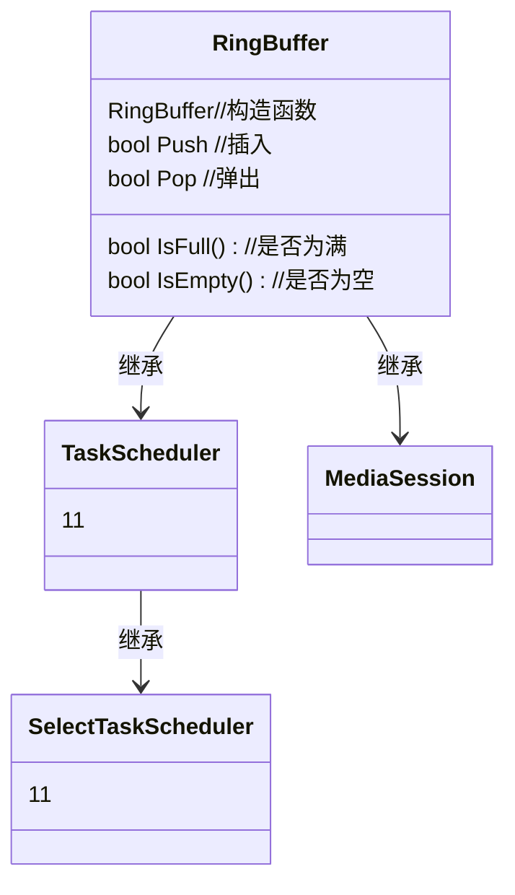

### std::forward 用于完美转发
### std::move 常用于提高效率或避免拷贝

```mermaid
classDiagram

class TaskScheduler{
11
}

class SelectTaskScheduler{
    11
}

class RingBuffer{
 RingBuffer//构造函数
 bool Push //插入
 bool Pop //弹出
 bool IsFull()//是否为满
 bool IsEmpty()//是否为空
}


RingBuffer --> TaskScheduler : 继承

RingBuffer --> MediaSession : 继承

TaskScheduler -->SelectTaskScheduler : 继承
```

