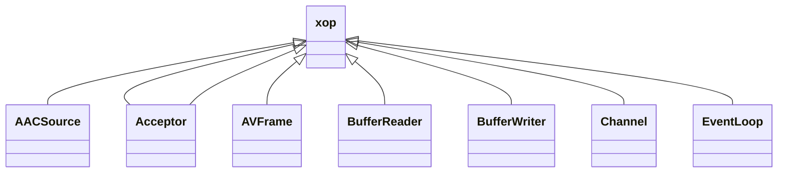
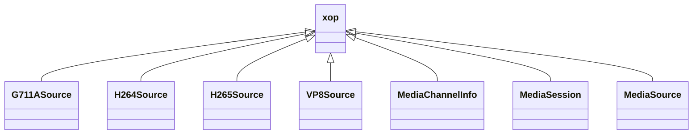
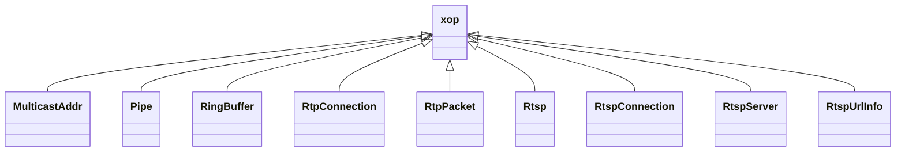
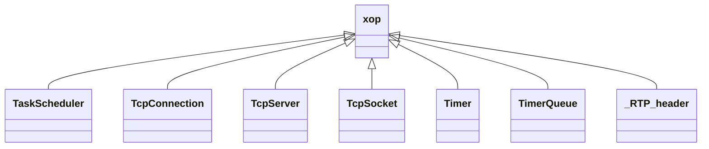
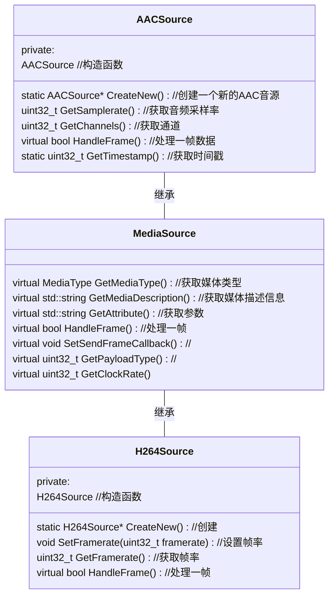
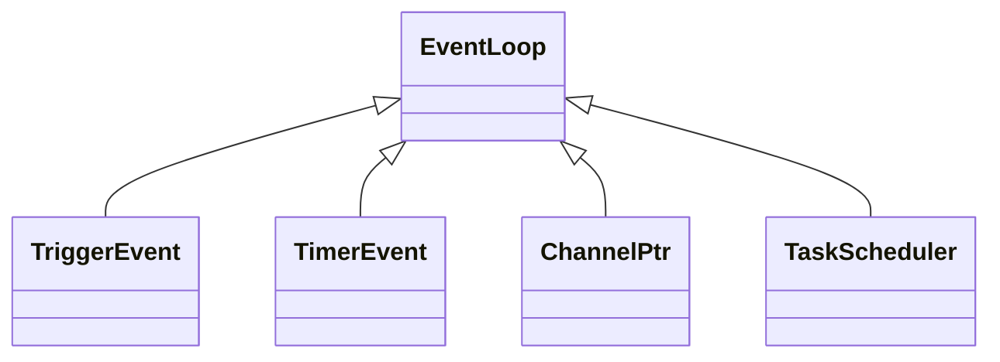
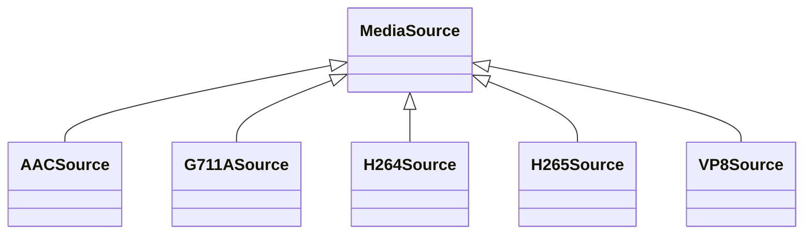
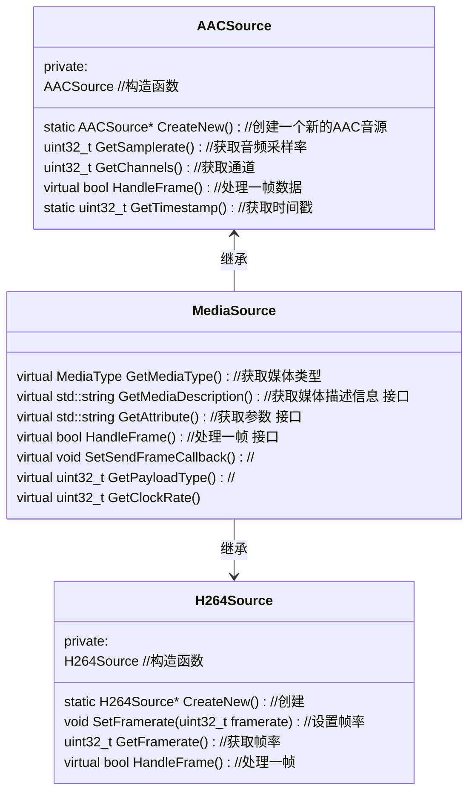

http://mermaid.js.org/syntax/flowchart.html

# XOP

```mermaid
classDiagram
xop <|-- AACSource
xop <|-- Acceptor
xop <|-- Acceptor
xop <|-- AVFrame
xop <|-- BufferReader
xop <|-- BufferWriter
xop <|-- Channel 
xop <|-- EventLoop
```

```mermaid
classDiagram

xop <|-- G711ASource
xop <|-- H264Source
xop <|-- H265Source
xop <|-- VP8Source
xop <|-- MediaChannelInfo
xop <|-- MediaSession
xop <|-- MediaSource

```

```mermaid
classDiagram
xop <|-- MulticastAddr
xop <|-- Pipe
xop <|-- RingBuffer
xop <|-- RtpConnection
xop <|-- RtpPacket
xop <|-- Rtsp
xop <|-- RtspConnection
xop <|-- RtspServer
xop <|-- RtspUrlInfo
```

```mermaid
classDiagram
xop <|-- TaskScheduler
xop <|-- TcpConnection
xop <|-- TcpServer
xop <|-- TcpSocket
xop <|-- Timer
xop <|-- TimerQueue
xop <|-- _RTP_header
```

```mermaid
classDiagram
xop <|-- TaskScheduler
xop <|-- TcpConnection
xop <|-- TcpServer
xop <|-- TcpSocket
xop <|-- Timer
xop <|-- TimerQueue
xop <|-- _RTP_header
```

# AACSource

```mermaid
classDiagram

  class AACSource {
    static AACSource* CreateNew()//创建一个新的AAC音源
    uint32_t GetSamplerate()//获取音频采样率
    uint32_t GetChannels()//获取通道
    virtual bool HandleFrame()//处理一帧数据
    static uint32_t GetTimestamp()//获取时间戳

private:
    AACSource //构造函数
  }

    class MediaSource{
    virtual MediaType GetMediaType() //获取媒体类型
	virtual std::string GetMediaDescription()//获取媒体描述信息
	virtual std::string GetAttribute()//获取参数
	virtual bool HandleFrame()//处理一帧
	virtual void SetSendFrameCallback()//
	virtual uint32_t GetPayloadType() //

	virtual uint32_t GetClockRate() 
  }

    class H264Source{
    static H264Source* CreateNew()//创建
	void SetFramerate(uint32_t framerate)//设置帧率
	uint32_t GetFramerate()//获取帧率
	virtual bool HandleFrame()//处理一帧

private:
	H264Source //构造函数
  }

AACSource -- MediaSource  : 继承
MediaSource -- H264Source  : 继承

```

```mermaid

classDiagram
EventLoop <|-- TriggerEvent
EventLoop <|-- TimerEvent
EventLoop <|-- ChannelPtr
EventLoop <|-- TaskScheduler

```

```mermaid
classDiagram
MediaSource <|-- AACSource
MediaSource <|-- G711ASource
MediaSource <|-- H264Source
MediaSource <|-- H265Source
MediaSource <|-- VP8Source

```

# AACSource

```mermaid
classDiagram

  class AACSource {
    static AACSource* CreateNew()//创建一个新的AAC音源
    uint32_t GetSamplerate()//获取音频采样率
    uint32_t GetChannels()//获取通道
    virtual bool HandleFrame()//处理一帧数据
    static uint32_t GetTimestamp()//获取时间戳

private:
    AACSource //构造函数
  }

  class MediaSource{
    virtual MediaType GetMediaType() //获取媒体类型
	virtual std::string GetMediaDescription()//获取媒体描述信息 接口
	virtual std::string GetAttribute()//获取参数 接口
	virtual bool HandleFrame()//处理一帧 接口
	virtual void SetSendFrameCallback()//
	virtual uint32_t GetPayloadType() //

	virtual uint32_t GetClockRate() 
  }

 class H264Source{
    static H264Source* CreateNew()//创建
	void SetFramerate(uint32_t framerate)//设置帧率
	uint32_t GetFramerate()//获取帧率
	virtual bool HandleFrame()//处理一帧

private:
	H264Source //构造函数
  }

AACSource <--  MediaSource  : 继承
MediaSource -- > H264Source  : 继承

```

