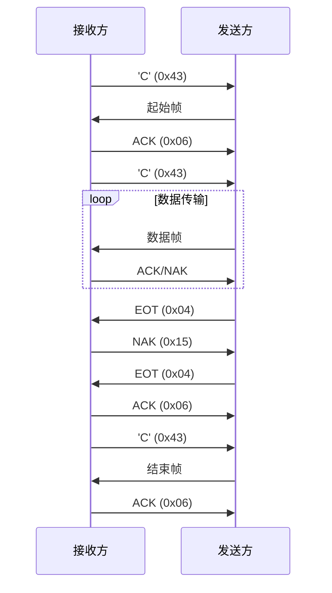

# Ymodem 协议详解

# 目前大部分MUC都内存空间比较大，标准ymodem协议只合适小于255K固件的文件，可以看最后我提议的改进
## 1. 协议概述
Ymodem 是基于 Xmodem 的增强型文件传输协议，支持 **1024 字节/帧** 的大数据块传输和 **CRC-16 校验**，适用于串行通信（如 UART、RS-232）和嵌入式系统场景（如 MCU 固件升级）[3,6](@ref)。

---

## 2. 核心特性
| 特性                | 说明            |
|---------------------|----------------------------------------------------------------------|
| **数据块大小**       | 支持 128 字节（SOH 模式）和 1024 字节（STX 模式）                   |
| **错误检测**         | 使用 CRC-16 循环冗余校验，校验范围包含数据块内容                    |
| **批处理传输**       | 可一次性发送多个文件，支持文件名和文件大小元数据传递                |
| **流量控制**         | 通过 ACK/NAK 机制实现自动重传，防止数据溢出                          |
| **填充规则**         | 数据不足时用 `0x1A` 填充，结束帧用 `0x00` 填充                      |

---

## 3. 帧格式说明

### 3.1 起始帧（133 字节）
| 字段            | 字节数 | 值            | 描述                         |
|-----------------|--------|---------------|------------------------------|
| **SOH**         | 1      | `0x01`        | 起始符（固定为 SOH）          |
| **块编号**       | 1      | `0x00`        | 固定为 00                    |
| **块编号反码**   | 1      | `0xFF`        | 块编号的二进制反码            |
| **文件名**       | 变长   | `foo.bin`     | 以 `0x00` 结尾的字符串        |
| **文件大小**     | 变长   | `1024`        | 十进制数值 + `0x00` 结尾      |
| **填充区**       | 剩余   | `0x00`        | 补满至 128 字节               |
| **CRC 校验码**   | 2      | `0x1234`      | 高字节在前，低字节在后        |

**示例**：

```
SOH 00 FF 66 6F 6F 2E 62 69 6E 00 31 30 32 34 00 00... CRCH CRCL
```


### 3.2 数据帧（1029/133 字节）
| 字段            | 字节数 | 值            | 描述                         |
|-----------------|--------|---------------|------------------------------|
| **STX/SOH**     | 1      | `0x02/0x01`   | 1024 字节用 STX，128 用 SOH  |
| **块编号**       | 1      | `0x01`        | 从 01 递增                   |
| **块编号反码**   | 1      | `0xFE`        | 块编号的二进制反码            |
| **数据区**       | 1024/128 | 原始数据      | 不足时用 `0x1A` 填充         |
| **CRC 校验码**   | 2      | `0x5678`      | 校验数据区内容               |

**示例**：

```
STX 01 FE [1024B 数据] CRCH CRCL
```

### 3.3 结束帧（133 字节）
| 字段            | 字节数 | 值            | 描述                         |
|-----------------|--------|---------------|------------------------------|
| **SOH**         | 1      | `0x01`        | 固定为 SOH                   |
| **块编号**       | 1      | `0x00`        | 固定为 00                    |
| **块编号反码**   | 1      | `0xFF`        | 固定为 FF                    |
| **填充区**       | 128    | `0x00`        | 全 0 填充                    |
| **CRC 校验码**   | 2      | `0x0000`      | 固定为 0                     |

---
**示例**：
```
SOH 00 FF 00 00 00 ... (共128字节0x00) 00 00
```


## 4. 控制字符表
| 字符 | ASCII 码 | 功能描述                     |
|------|----------|------------------------------|
| SOH  | `0x01`   | 128 字节数据块起始标志        |
| STX  | `0x02`   | 1024 字节数据块起始标志       |
| EOT  | `0x04`   | 传输结束标志                 |
| ACK  | `0x06`   | 确认接收成功                 |
| NAK  | `0x15`   | 请求重传（校验失败/超时）     |
| CAN  | `0x18`   | 取消传输                     |
| 'C'  | `0x43`   | 接收方发起传输请求            |

---


## 5. EOT 控制信号

EOT（End Of Transmission）是 Ymodem 协议中用于标识**单次文件传输结束**的控制字符，其结构为：
- **ASCII 码**：`0x04`
- **功能**：发送方在文件数据传输完毕后发送该信号，触发接收方的二次确认流程[2,5](@ref)。

**示例**：  
发送方发送：`0x04`（单个字节的 EOT 信号）

```
0x04
```

### **5.1 EOT 信号交互流程**
EOT 的完整传输流程包括**双重确认**机制，确保传输可靠性：

1. **首次 EOT 发送**  
   发送方完成数据包传输后，发送 `0x04`。

2. **接收方 NAK 响应**  
   接收方回复 `0x15`（NAK），要求二次确认。

3. **二次 EOT 发送**  
   发送方重传 `0x04`。

4. **接收方 ACK 确认**  
   接收方回复 `0x06`（ACK），完成当前文件传输


## 6. 传输流程

## 可改进方向

### 当块编号大于0x1-0xff 的时候，也就是文件大于255*1024,也就是255K的时候文件块号会从0x00开始

### 可以改进块编号反码，也作为传输文件的块号。最大传输65535*1024 也就是64M